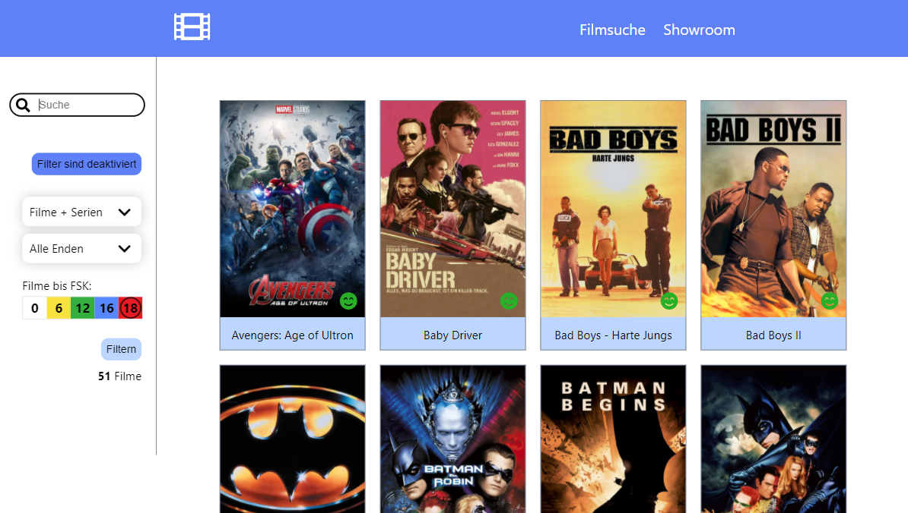

# Happy End Movies

In this App you can choose if a movie has a Happy End. And then you can filter movies by Happy Ending.

It works with an API from The Movie Database and altersfreigaben.de.

This Project was to learn more about API's and storing Data on Firebase.

This project was bootstrapped with [Create React App](https://github.com/facebook/create-react-app).

###Bewertung
Search Movies in Database TMDB

###Details
Look for Details like genres, directors,voting on TMDB, description and more.
Also get Information about FSK from altersfreigaben.de.
And searching for actors and role names.\
You can rate movie by Happy End and save your whole movie data to Firebase Firestore.

###Showroom
Here you can see all Movies in Firebase Database and filter if the Movie
has a Happy End or not.  
You can also filter Movies at the search-bar.\
By clicking on a Movie you come to the Details Section.

## First start

You first have to install all dependencies by running
`npm install`

## Available Scripts

In the project directory, you can run:

### `npm start` or
### `yarn start`

Runs the app in the development mode.\
Open [http://localhost:3000](http://localhost:3000) to view it in the browser.

The page will reload if you make edits.\
You will also see any lint errors in the console.

### `yarn test`

Launches the test runner in the interactive watch mode.\
See the section about [running tests](https://facebook.github.io/create-react-app/docs/running-tests) for more information.

### `yarn build`

Builds the app for production to the `build` folder.\
It correctly bundles React in production mode and optimizes the build for the best performance.

The build is minified and the filenames include the hashes.\
Your app is ready to be deployed!

See the section about [deployment](https://facebook.github.io/create-react-app/docs/deployment) for more information.

### `yarn eject`

**Note: this is a one-way operation. Once you `eject`, you can’t go back!**

If you aren’t satisfied with the build tool and configuration choices, you can `eject` at any time. This command will remove the single build dependency from your project.

Instead, it will copy all the configuration files and the transitive dependencies (webpack, Babel, ESLint, etc) right into your project so you have full control over them. All of the commands except `eject` will still work, but they will point to the copied scripts so you can tweak them. At this point you’re on your own.

You don’t have to ever use `eject`. The curated feature set is suitable for small and middle deployments, and you shouldn’t feel obligated to use this feature. However we understand that this tool wouldn’t be useful if you couldn’t customize it when you are ready for it.
